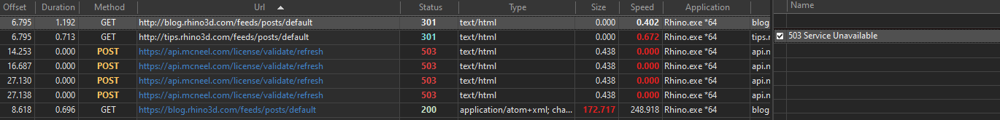

# RhinoAppendPatch
## What is this
When you want to activate your Rhino software, you need unlink your internet or block your firewall, but i found this method not work in latest version. So i patched the website verify API,now it works well😊.

## Description
### Found internet activation server
In this picture, we can get the website "api.***.com" and when we select auto-reply to this post with 503 error, it will work.

Some times later, I found this post send through ZooClient.dll.So we can patch this dll with invalid license server,ex:127.0.0.1.

## How to use this
You can download my patch and use activator.exe to get your license key, copy ZooClient.dll to your Rhino directory.
 
⚠️ Test this only on 7.26 version.

